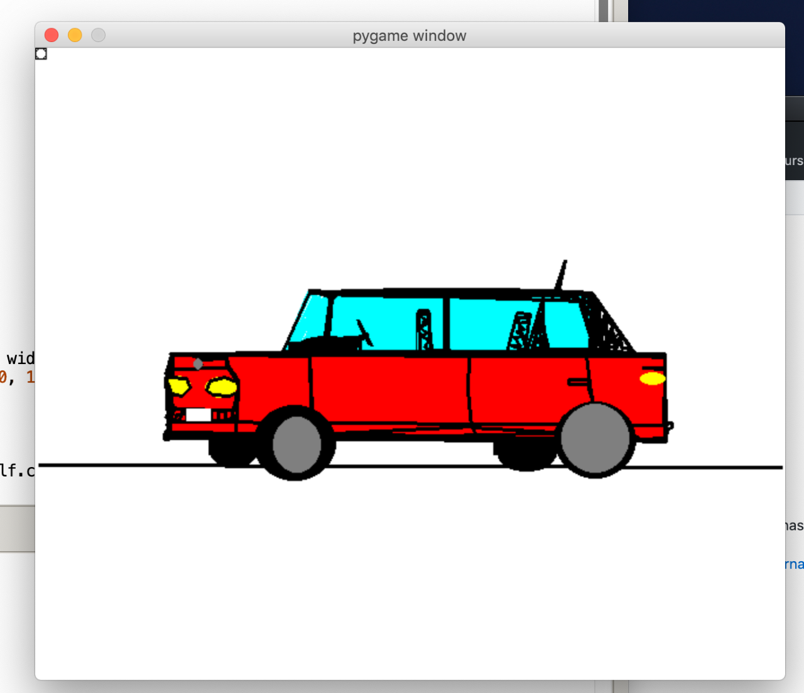
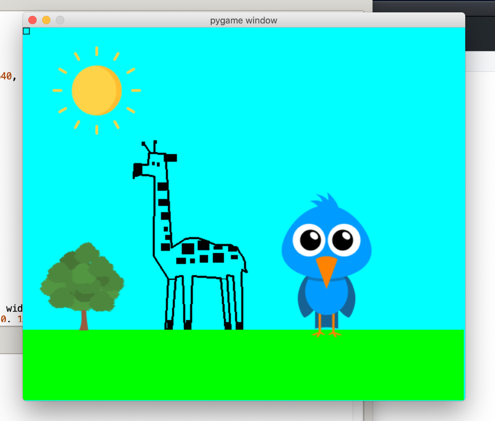
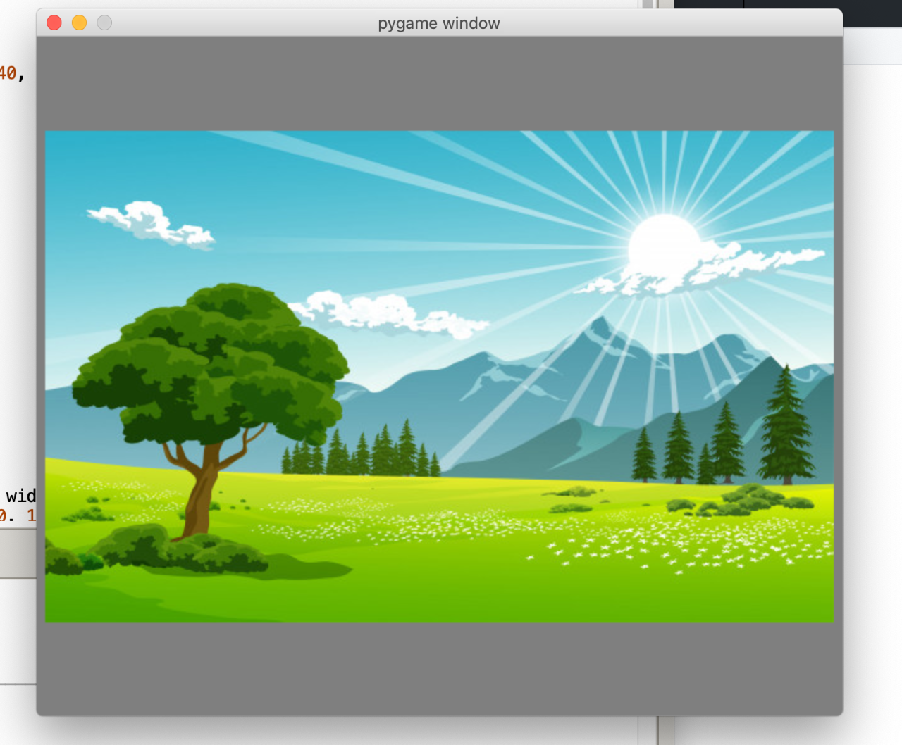

# oc20 - projet Editor
- Jean Paulsen et Walid Heckendorn 3M7
- Fichier: EDITOR_OFFICIAL.py

## Introduction

Editeur graphique en programmation python permettant de créer et manipuler librement différents types d'objets et images. 

## Description
Editeur graphique structuré en 4 classes Shape définis: Rectangle, Polygone, Ellipse, Image.
L'editeur permet différente manoeuvre tel que globalement:

- créer et manipuler multiples formes et images. (rectangles, ellipses, polygones et images)
- changer la forme, couleur et épaisseur des formes créés.
- supprimer les objets créés ou en ajouter.
- changer l'image et/ou en ajouter d'autre.
- modifier la couleur du fond.

- Voici quelques exemples:

## Interface
Thonny 

## Raccourcis claviers
- K_(a, s, b): épaiseur forme
- K_(Q;i) : couleur forme
- K_(8, 9, 0): couleur screen
- K_(1;4): selection mode
- K_TAB: supprime la dernière forme
### polygone: 
- K_1: mode polygone
- K_BACKSPACE: supprimer point polygone
### rectangle:
- K_2: mode rectangle
### ellipse:
- K_3: mode ellipse
### image:
- K_4: insérer image
- K_l: modifier image
- K_m: bouger l'image
- K_n: arrête de bouger l'image

## Conclusion:
- Programme réalisé avec certaines difficultés, mais objectif considéré comme atteint car le programme 
permet un ensemble de commandes relativement élevés. 
- Nous aurions aimé pouvoir modifier ou déplacer les objets en les sélectionnant, sans forcément qu'il
s'agisse du dernier objet de la liste. Nous ne l'avons pas fait par manque de temps d'abord, ensuite 
car nous considérions que le programme était suffisamment complexe compte tenu des attentes.
- Difficulté principale: créer des classes d'objet et leurs attribuer des méthodes (self).
- MERCI!

