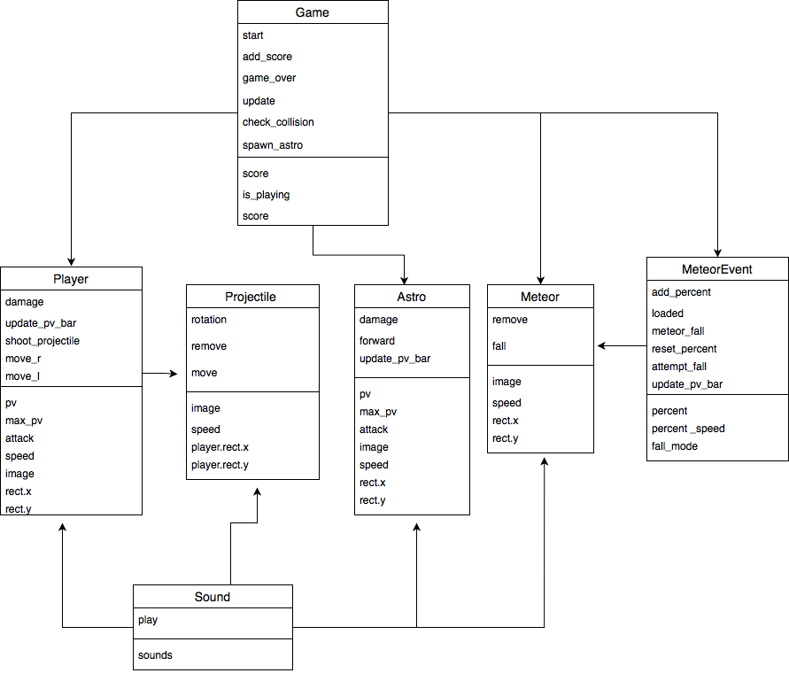

# Space Invasion game presentation

fichier :  GAME/GAME.py + assets

Le jeu que nous avons produit, "Space Invasion" consiste à resister face aux astronautes venus pour envahir l'espace et à une pluit de météorites enflamées. Afin de se défendre, en tant qu'alien, nous avons le pouvoir de tirer des projectiles sur les envahisseurs avec la touche espace. 
Pour échapper aux météorites, il faut les esquiver en allant de droite à gauche, grace aux flèches pressent sur le clavier.

le but du jeu est de résiter le plus longtemps possible aux différentes vague d'astronaute et de météorite afin de faire le meilleur score possible. Chaque astronaute tué rapporte 10 points.

## Explication globale de la structure du jeu

Ici, il s'agit du menu du jeu. Lorsque le START est enclenché, le "while running" se met en marche pour lancer le jeu. Le jeu est gérer par la class Game, la méthode update actualise et applique les éléments. 

L'alien, incarné par le joueur, perd des points de vie lorsqu'il rentre en contact avec les astronautes. Il peux les éliminer en tirant des projectiles, remporter des points.

L'alien est géré par une classe Player, qui hérite de Game. Cette classe est composé de plusieur méthodes tel que, par exemple, shoot_projectile qui gère le lancé des projectiles, move_r et move_l qui gère les déplacements de gauche à droite. 

Les astronautes sont gérés par leur propre classe Astro. Cette classe gère les attack, la vitesse etc de l'astronaute. Aussi les dégats qu'elle génère sur l'alien. Cette classe Astro hérite de Game.
Les astronautes spawn aléatoirement par deux dans un random.randint près-défini et avec une vitesse variante. Ceci permet d'éviter que les astronautes se superposent. Lorsqu'un astronaute est éliminé, il respawn et le joueur gagne 10 points de score.

L'alien autant que les astronautes ont une bar de point de vie qui permet de connaitre leurs pv actuels par rapport à leur pv maximum. Cette dernière est gérer par la "méthode update_pv_bar" qui se situe dans la classe Astro et Player. Elle superpose deux rectangles, la longueur de celui du fond est égal au maximum de pv, la longueur du rectangle rouge est égal aux pv actuelles du player.

l'alien est confronté a une pluit de météorites. Ces dernieres sont gérer par une classe Meteor qui défini la vitesse, le nombre et les dégats des météorites. L'événement de la chute d'asteroid est gérer par la classe MeteorEvent. Cette classe enclanche la chute de météorite quand certain critère sont remplis, tel que la bar d'événement en bas de l'écran. Cette dernière doit être pleine pour enclencher l'événement CometFall. Ces deux classe hérite de Game.

Les projectiles tirés par l'alien, visible sur la capture, sont gérés par une class Projectiles. Cette dernière gère la vitesse, la rotation et les collisions des projectiles. Elle hérite aussi de Game.

Certain événement du jeu sont associés à des sons tel que les tirs, la chute des comets, la mort du joueur et le start du jeu.
Ces sons ont leurs propre class Sound qui les gère et les associe à une action du jeu.

Pour faire fonctionner notre jeu, nous avons utilisé des classes dites héréditaires. Presque toute les classes hérite de "Game", qui est la classe qui gère le jeu. La mort du joueur, le déplacements des monstres, les collisions, les spawn etc. Cette classe permet aussi d'appliquer les éléments, de les actualiser au début de chaque partie, dans la méthode "update".

Afin de mieux comprendre la structure des classe, voici un schéma de ces dernières ainsi que leurs attributs. 

Nous avons essayer de vous présenter le jeu de manière à la fois globale et précise,
MERCI !

Source : 
* pygame.org
* youtube.com/Collisons in Pygame
* youtube.com/Pygame in 90 Minutes - For beginners
* youtube.com/Python Final Fantasy Style RPG Battle Beginner Tutorial in Pygame
