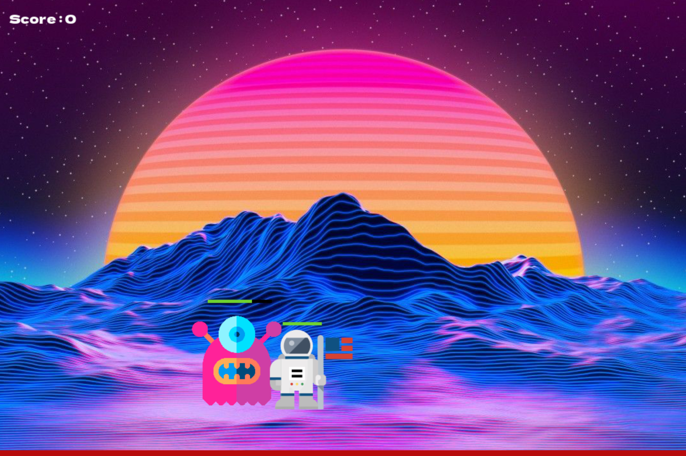

# Space Invasion game presentation

# fichier : JeanPaulsen26 - GAME/GAME.py + assets

Le jeu que nous avons produit, "Space Invasion" consiste à resister face aux astronautes venus pour envahir l'espace et à une pluit de météorites. Afin de se défendre, en tant qu'alien, nous avons le pouvoir de tirer des projectiles sur les envahisseurs avec la touche espace. 
Pour échapper aux météorites, il faut simplement les ésquiver en allant de droite à gauche, grace aux flèches pressent sur le clavier.

Ce jeu contient différents niveaux, il faut d'abord tuer tous les astronautes pour ensuite affronter les météorites et ainsi de suite. le but finale de ce jeu est de faire le meilleur score possible. Chaque astronaute tué rapporte 10 points.

## Explication globale de la structure du jeu

Ici, il s'agit du menu du jeu. Lorsque le START est enclencher, le "while running" se met en marche pour lancer le jeu. Le jeu est gérer par la class Game, la méthode update actualise et applique les éléments. 

L'alien, incarné par le joueur, perd des points de vie lorsqu'il rentre en contact avec les astronautes. Il peux les éliminer en tirant des projectiles, remporter des points.

L'alien est géré par une classe Player, qui hérite de sprite. Cette classe est composé de plusieur méthode tel que, par exemple, _init_ qui défini la vitesse, les pv etc du joueur, move_r/l qui gère les déplacements. 

Les astronautes sont gérés par leur propre classe Astro. Cette classe gère les dégats, la vitesse etc de l'astronaute mais aussi les collisions propre à ce dernier et les dégat qu'elle génère sur l'alien 
Les astronautes spawn aléatoirement par deux dans un random.randint près-défini. Ceci permet d'éviter que les astronautes se superposent. Lorsqu'un astronaute est éliminé, il respawn et le joueur gagne 10 points de score.

L'alien autant que les astronautes ont une bar de point de vie qui permet de connaitre leurs pv actuels par rapport à leur pv maximum. Cette dernière est gérer par la "méthode update_pv_bar" qui se situe dans la classe Astro et Player. Elle superpose deux rectangles, la longueur de celui du fond est égal au maximum de pv, la longueur du rectangle rouge est égal aux pv actuelles du player.

l'alien est confronté a une pluit de météorites. Ces dernieres sont gérer par une classe Comet qui défini la vitesse, le nombre et les dégats des météorites. L'événement de la chute d'asteroid est gérer par la classe CometFallEvent. Cette classe enclanche la chute de météorite quand certain critère sont remplis, tel que la bar d'événement en bas de l'écran. Cette dernière doit être pleine pour enclencher l'événement CometFall.

Les projectiles tirés par l'alien, visible sur la capture, sont gérés par une class Projectiles. Cette dernière gère la vitesse, la rotation et les collisions des projectiles.

Certain événement du jeu sont associé à des sons tel que les tirs, la chute des comets, la mort du joueur et le start du jeu.
Ces sons ont leurs propre class SoundManager qui les gère et les associe à une action du jeu.

Pour faire fonctionner notre jeu, nous avons utilisé des classes dites héréditaires. La plupart des classes hérite de "Game", qui est la classe qui gère le jeu. La mort du joueur, le déplacements des monstres, les collisions, les spawn etc. Cette classe permet aussi d'appliquer les éléments, de les actualiser au début de chaque partie, dans la méthode "update".

MERCI !

Source : 
* pygame.org
* youtube.com/Collisons in Pygame
* youtube.com/Pygame in 90 Minutes - For beginners
* youtube.com/Python Final Fantasy Style RPG Battle Beginner Tutorial in Pygame
