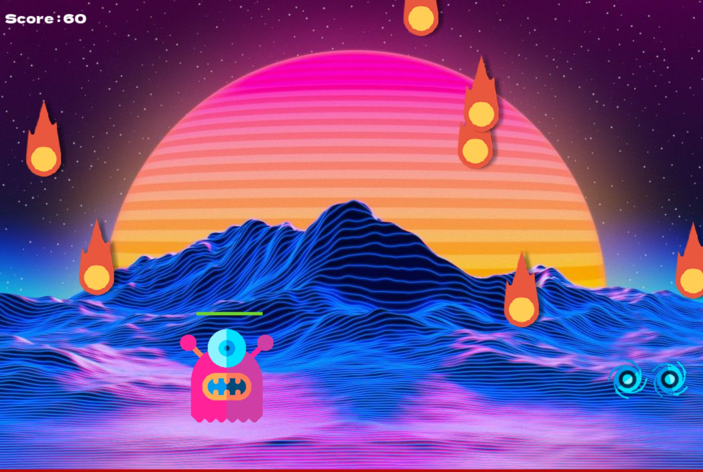

# Présentation du jeu

Le jeu que nous avons produit consiste à resister face aux astronautes venus nous envahir et à une pluit de météorites. Afin de se défendre, en tant qu'alien, nous avons le pouvoir de tirer des projectiles sur les envahisseurs avec la touche espace. 
Pour échapper aux météorites, il faut simplement les ésquiver en allant à droite ou à gauche, grace aux flèches present sur le clavier.
Ce jeu contient différents niveaux, il faut d'abord tuer tous les astronautes pour ensuite affronter les météorites. Une fois terminer, le niveau suivant est activé et la difficulté est augmenté. le but finale de ce jeu est de faire le plus de point possible

## exemple

Ici, il s'agit du menu du jeu

l'alien perd des pointnde vie lorsqu'il rentre en contact avec l'astronautes.

l'alien est confronter a une pluit de météorites.

Pour faire fonctionner notre jeu, nous avons utilisé des classes dites héréditaires

